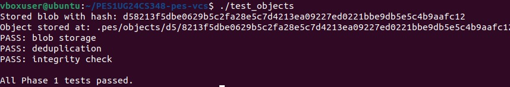
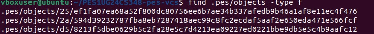
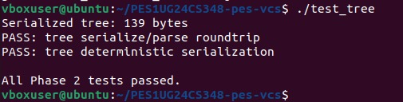
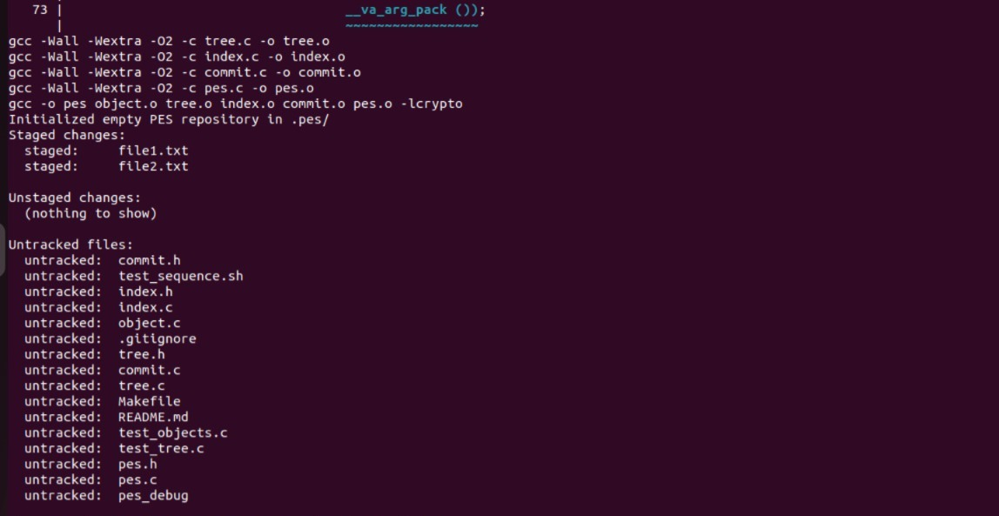
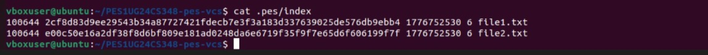
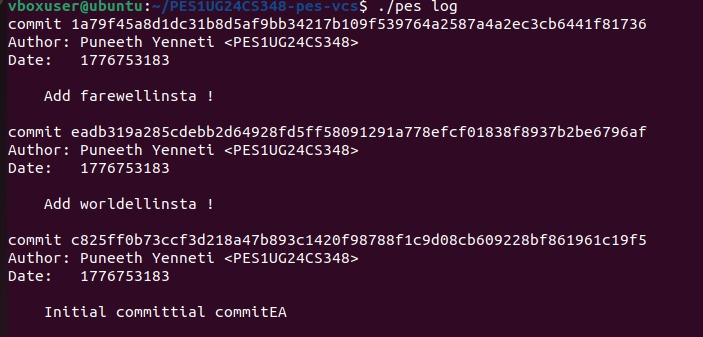
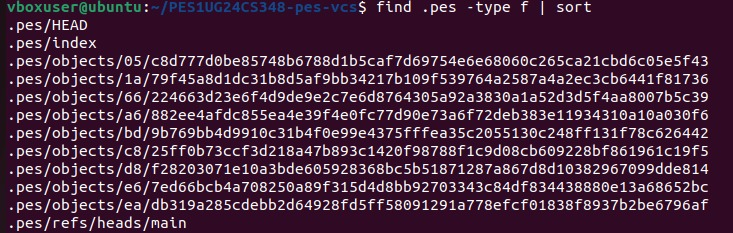
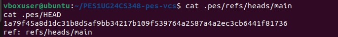
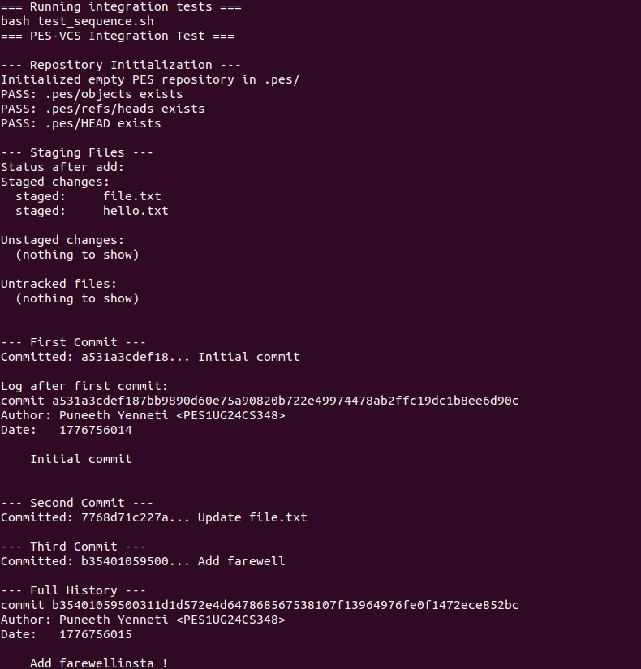
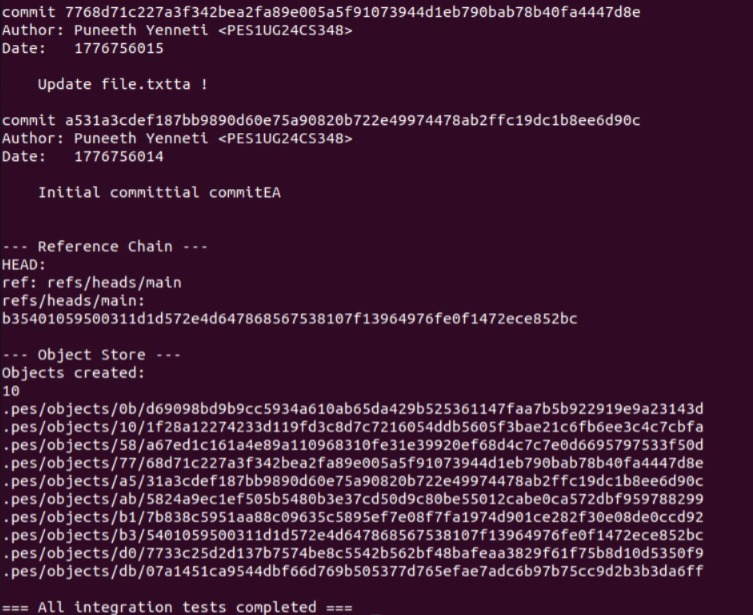

# PES-VCS — A Version Control System from Scratch

**Objective:** Build a local version control system that tracks file changes, stores snapshots efficiently, and supports commit history — mapping directly to OS and filesystem concepts.

**Platform:** Ubuntu 22.04 | **Language:** C |**Name:** Puneeth Yenneti |**SRN:** `PES1UG24CS348` | **Section:** 4-F

---

## Table of Contents

- [File Inventory](#file-inventory)
- [Prerequisites & Build](#prerequisites--build)
- [Commands](#commands)
- [Running Tests](#running-tests)
- [Phase 1 — Object Storage](#phase-1--object-storage)
- [Phase 2 — Tree Objects](#phase-2--tree-objects)
- [Phase 3 — Index (Staging Area)](#phase-3--index-staging-area)
- [Phase 4 — Commits and History](#phase-4--commits-and-history)
- [Phase 5 — Branching (Analysis)](#phase-5--branching-analysis)
- [Phase 6 — Garbage Collection (Analysis)](#phase-6--garbage-collection-analysis)

---

## File Inventory

| File               | Role                                  | Status           |
|--------------------|---------------------------------------|------------------|
| `pes.h`            | Core data structures and constants    | PROVIDED         |
| `object.c`         | Content-addressable object store      | Implemented      |
| `tree.h`           | Tree object interface                 | PROVIDED         |
| `tree.c`           | Tree serialization and construction   | Implemented      |
| `index.h`          | Staging area interface                | PROVIDED         |
| `index.c`          | Staging area (text-based index file)  | Implemented      |
| `commit.h`         | Commit object interface               | PROVIDED         |
| `commit.c`         | Commit creation and history           | Implemented      |
| `pes.c`            | CLI entry point and command dispatch  | PROVIDED         |
| `test_objects.c`   | Phase 1 unit tests                    | PROVIDED         |
| `test_tree.c`      | Phase 2 unit tests                    | PROVIDED         |
| `test_sequence.sh` | End-to-end integration test           | PROVIDED         |
| `Makefile`         | Build system                          | PROVIDED         |

---

## Prerequisites & Build

```bash
sudo apt update && sudo apt install -y gcc build-essential libssl-dev
```

```bash
make          # Build the pes binary
make all      # Build pes + test binaries (test_objects, test_tree)
make clean    # Remove all build artifacts and .pes/
```

### Author Configuration

```bash
export PES_AUTHOR="Puneeth Yenneti <PES1UG24CS348>"
```

---

## Commands

| Command                  | Description                                    |
|--------------------------|------------------------------------------------|
| `./pes init`             | Initialize a `.pes/` repository                |
| `./pes add <file>...`    | Stage one or more files                        |
| `./pes status`           | Show staged, modified, and untracked files     |
| `./pes commit -m <msg>`  | Create a commit from staged files              |
| `./pes log`              | Walk and display commit history                |

---

## Running Tests

```bash
# Unit tests (Phase 1 + Phase 2)
make test-unit

# Full end-to-end integration test
make test-integration

# Run everything
make test
```

---

## Phase 1 — Object Storage

Implements `object_write` and `object_read` in `object.c` — content-addressable storage using SHA-256, directory sharding, and atomic temp-file-then-rename writes.

### Screenshot 1A — `./test_objects` passing



### Screenshot 1B — Sharded object directory

```bash
find .pes/objects -type f
```



---

## Phase 2 — Tree Objects

Implements `tree_from_index` in `tree.c` — builds a tree hierarchy from the index, handling nested paths and writing all tree objects to the object store.

### Screenshot 2A — `./test_tree` passing



### Screenshot 2B — Raw tree object (binary format)

```bash
xxd .pes/objects/XX/YYY... | head -20
```


---

## Phase 3 — Index (Staging Area)

Implements `index_load`, `index_save`, and `index_add` in `index.c` — text-based index format (`<mode> <hash> <mtime> <size> <path>`) with atomic saves and mtime/size-based change detection.

### Screenshot 3A — `pes init` → `pes add` → `pes status`



### Screenshot 3B — `cat .pes/index`



---

## Phase 4 — Commits and History

Implements `commit_create` in `commit.c` — builds a tree from the index, reads current HEAD as parent, writes the commit object, and updates HEAD atomically.

### Screenshot 4A — `./pes log` (three commits)



### Screenshot 4B — Object store growth

```bash
find .pes -type f | sort
```



### Screenshot 4C — Reference chain

```bash
cat .pes/refs/heads/main
cat .pes/HEAD
```



### Screenshot — Full integration test

```bash
make test-integration
```




---

## Phase 5 — Branching (Analysis)

### Q5.1 — Implementing `pes checkout <branch>`

Ans: To implement `pes checkout <branch>`, the following steps are required:

**Files that change in `.pes/`:**
- `.pes/HEAD` is updated to `ref: refs/heads/<branch>`
- `.pes/index` is rebuilt to match the target branch's tree

**Steps:**

1. **Resolve target** — read `.pes/refs/heads/<branch>` to get the target commit hash.
2. **Retrieve tree** — read the commit object for its root tree hash, then recursively
   walk the tree objects to build a complete map of target file paths and their blob hashes.
3. **Update working directory** — create or overwrite files that exist in the target tree;
   delete files that exist in the current tree but not in the target.
4. **Update index** — rebuild `.pes/index` to exactly match the checked-out tree.
5. **Update HEAD** — write `ref: refs/heads/<branch>` to `.pes/HEAD`.

### Q5.2 — Detecting dirty working directory conflicts during checkout

Ans: To detect a dirty working directory conflict using only the index and object store:

1. **Identify local changes** — compare each file in the working directory against its
   entry in `.pes/index` using `mtime` and `size`. A mismatch means the file is locally modified.

2. **Detect conflicts** — for each locally modified file, check if the target branch's
   tree has a different blob hash for that path compared to the current HEAD tree.

3. **Block on conflict** — if a file is both locally modified and differs between the
   current and target trees, abort the checkout with an error.

4. **Allow safe checkout** — if the locally modified file is identical in both the
   current and target trees, the checkout can proceed safely.

### Q5.3 — Detached HEAD: commits and recovery

- A detached HEAD occurs when `.pes/HEAD` contains a raw commit hash
  instead of a branch reference like `ref: refs/heads/main`.

- **Committing** — commits can still be made. `.pes/HEAD` updates to each new commit's
  hash. However, since no branch reference tracks these commits, they become orphaned
  the moment you switch to another branch.

- **Recovery** — find the hash of the last commit (from terminal scrollback or an
  internal log if implemented), then manually create a branch pointing to it:
  `echo <hash> > .pes/refs/heads/recovery-branch`. This makes the commits reachable again.

---

## Phase 6 — Garbage Collection (Analysis)

### Q6.1 — Algorithm to find and delete unreachable objects

Ans: A standard mark-and-sweep algorithm can be used:

**Mark phase:**
- Read all references in `.pes/refs/heads/` and `.pes/HEAD`.
- Read `.pes/index` to catch currently staged blobs.
- For each commit, parse it and mark it as reachable, then recursively walk its
  root tree, sub-trees, and blobs, marking every encountered hash as reachable.

**Sweep phase:**
- Walk all files under `.pes/objects/`.
- Reconstruct each object's hash from its shard directory and filename.
- Delete any file whose hash is not in the reachable set.

**Data structure:** a hash set (e.g. a hashtable or bitset keyed on the object hash)
for O(1) reachability lookups.

**Estimate:** for 100,000 commits across 50 branches, assuming each commit references
a tree with ~20 objects on average, you would visit roughly 2,000,000 objects during
the mark phase.

### Q6.2 — Race condition between GC and concurrent commit

Ans:
**The race condition:**
If GC runs while `pes add` or `pes commit` is in progress, new objects (blobs/trees)
are being written to `.pes/objects/` but the commit has not yet updated a reference
in `.pes/refs/heads/`. The GC mark phase will not see these objects, and the sweep
phase will delete them as unreachable, corrupting the in-progress commit.

**Mitigation:**
1. **Grace period** — only delete unreachable objects older than a time threshold
   (e.g., 2 weeks, as Git does). Newly written objects are safe even if temporarily unreachable.
2. **Lock file** — use a repository-level lock (e.g., `.pes/gc.lock`) to prevent
   concurrent writes during GC.

---

## Test Results Summary

| Phase | Test | Status |
|-------|------|--------|
| Phase 1 | `./test_objects` | Passed|
| Phase 2 | `./test_tree` | Passed |
| Phase 3 | `pes init` → `add` → `status` | Passed |
| Phase 4 | `pes log` (3 commits) | Passed |
| Final | `make test-integration` | Passed |

---

## Further Reading

- [Git Internals — Pro Git](https://git-scm.com/book/en/v2/Git-Internals-Plumbing-and-Porcelain)
- [Git from the inside out](https://codewords.recurse.com/issues/two/git-from-the-inside-out)
- [The Git Parable](https://tom.preston-werner.com/2009/05/19/the-git-parable.html)